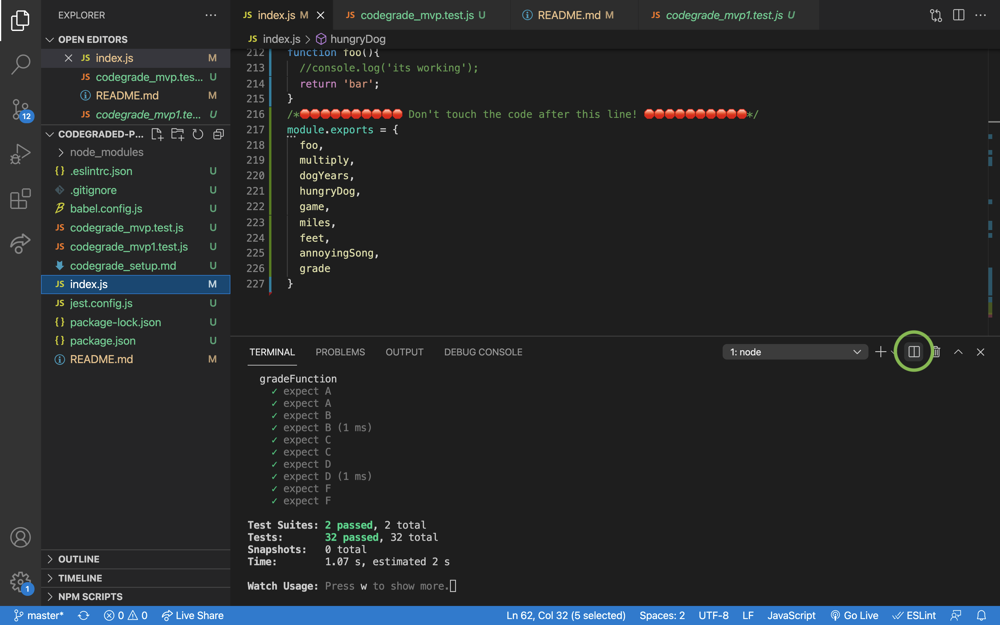
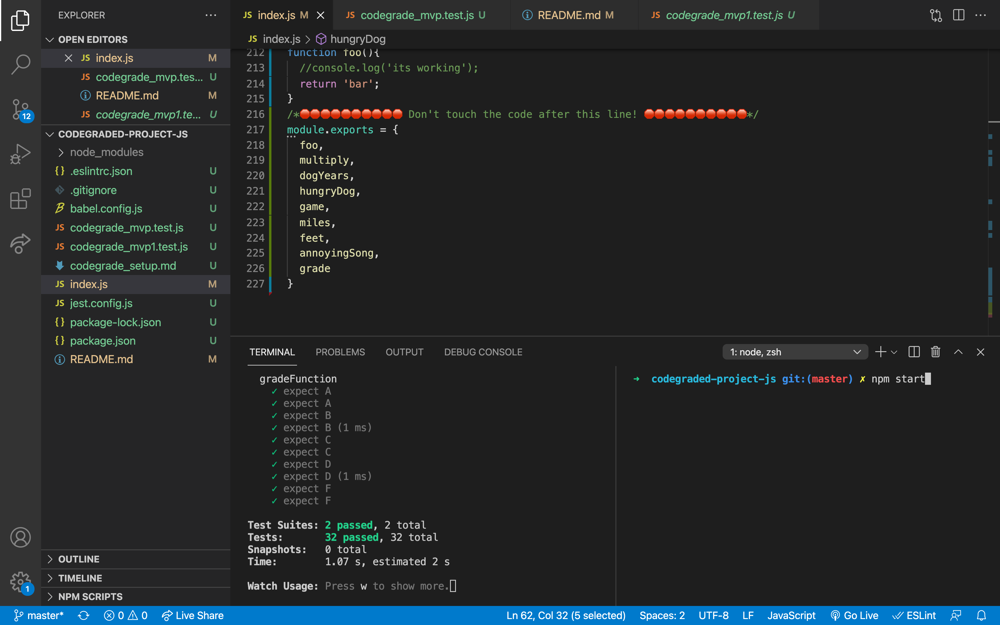
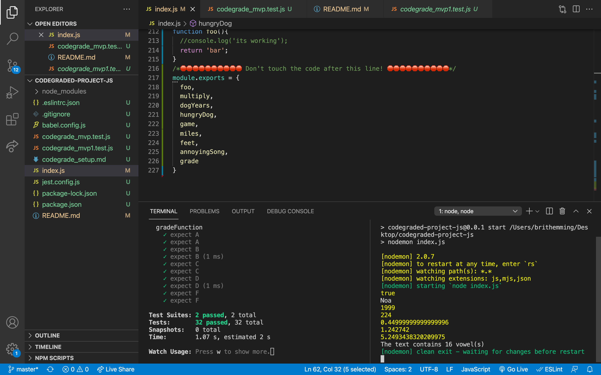

# The _class_ Syntax

This challenge focuses on using the new for ES6 `class` syntax.

## JavaScript Fundamentals

## Objectives

- Student should be able to describe and demonstrate how class syntax works
- Student should be able to convert a pseudo classically instantiated program into class syntax

## Instructions

### Task 1: Set up Project

Using VSCode and Command Line:

1. Fork the repo
2. Clone your forked version of the repo
3. cd into your repo and create a branch with your first and last name
4. open the terminal in your vs code and type `npm install`
5. next type `npm run test` in your terminal
6. Complete your work making regular commits, once you have all your tests passing and you are ready to submit your work please see canvas for instructions on how to submit

### Task 2 - MVP

Find the file `index.js` and complete the tasks until all of your tests pass.

**You can use yesterday's work to help you.** However, if you struggled a lot with that assignment, it is recommended that you attempt to re-write all code without "cheating" (peeking at yesterday's code or copy-pasting it).

If you run into trouble while coding, fight the good fight for 20 minutes and then get on the help channel. __Remember to formulate your help request in a professional manner__ - like you would at the job - by including error messages, screenshots, and any other pertinent information about the problem, as well as what things you have attempted already while trying to solve it.

### Testing & Debugging

Open a second terminal inside of your project by clicking on the split terminal icon

Inside of your second terminal type `npm start` 

You will be running your tests in one terminal and debugging in the other. As you work on your code you should make use of `console.log` to check your progress and debug.

### Task 3 - Stretch 

There are stretch goals found throughout `index.js`. Complete these after you have all of your tests passing for MVP!

## Submission format

Please submit your project via codegrade by following [these instructions](https://www.notion.so/lambdaschool/Submitting-an-assignment-via-Code-Grade-A-Step-by-Step-Walkthrough-07bd65f5f8364e709ecb5064735ce374)
