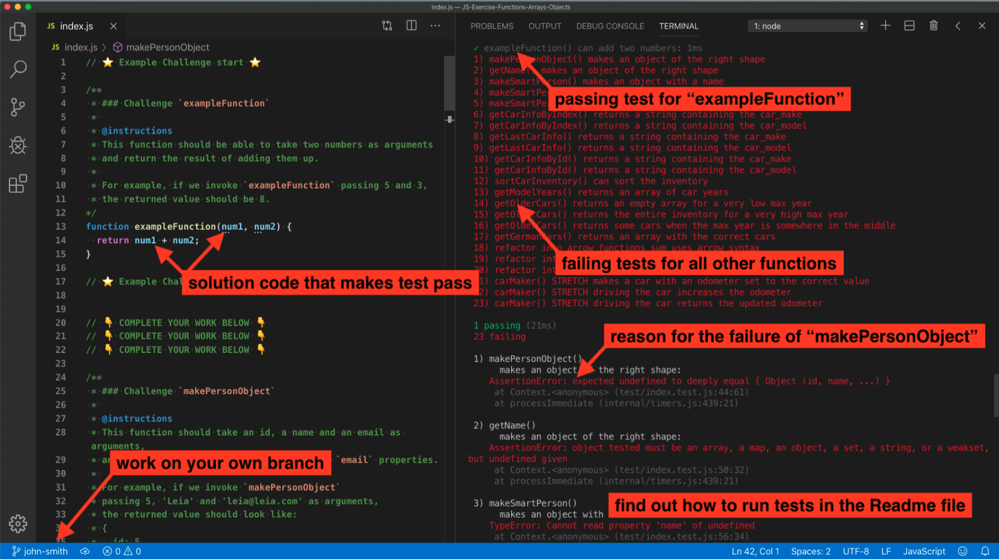

# Tanveer Saleem
# The _class_ Syntax

This challenge focuses on using the new for ES6 `class` syntax.

##### Index

* [Instructions](#instructions)
* [Get Started](#get-started)

## Instructions

Find the file `index.js` and complete the tasks until all of your tests pass.

**You can use yesterday's work to help you.** However, if you struggled a lot with that assignment, it is recommended that you attempt to re-write all code without "cheating" (peeking at yesterday's code or copy-pasting it).

**Plan to commit & push every time you get a new test passing!**. Committing often makes it SO much easier to figure out "what broke my code", and helps your TL keep track of how you're doing.

If you run into trouble while coding, fight the good fight for 20 minutes and then get on the help channel. __Remember to formulate your help request in a professional manner__ - like you would at the job - by including error messages, screenshots, and any other pertinent information about the problem, as well as what things you have attempted already while trying to solve it.

## Get Started

<strong>Using VSCode and the Command Line:</strong>

1. Fork repo and add TL as collaborator on Github.
1. Clone _your_ fork (not Lambda's repo by mistake!).
1. `cd` into your newly cloned repository.
1. Create a new branch by typing `git checkout -b <firstName-lastName>`.
1. Install dependencies by typing `npm install`.
1. Run tests by typing `npm run test:watch`.
1. Work on your branch, push commits and create PR as usual.

